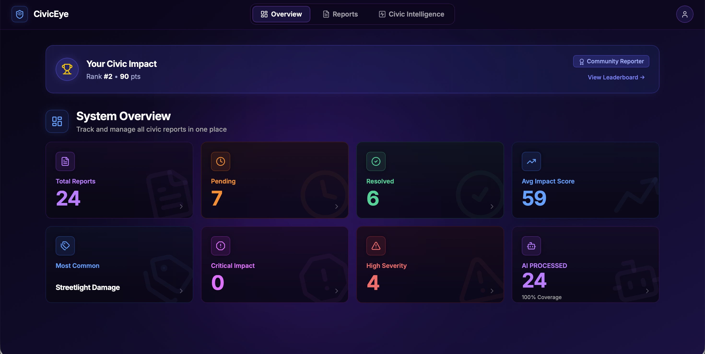
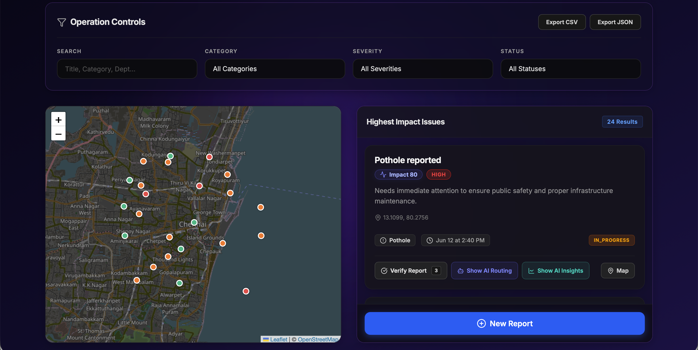
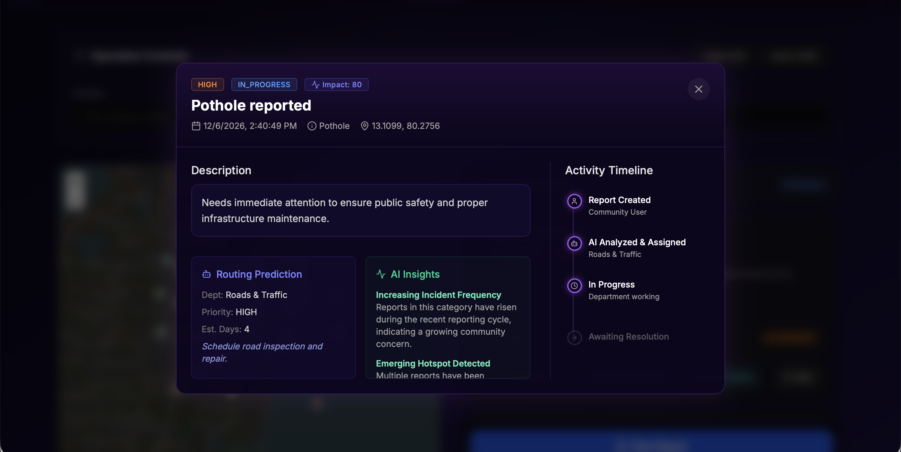
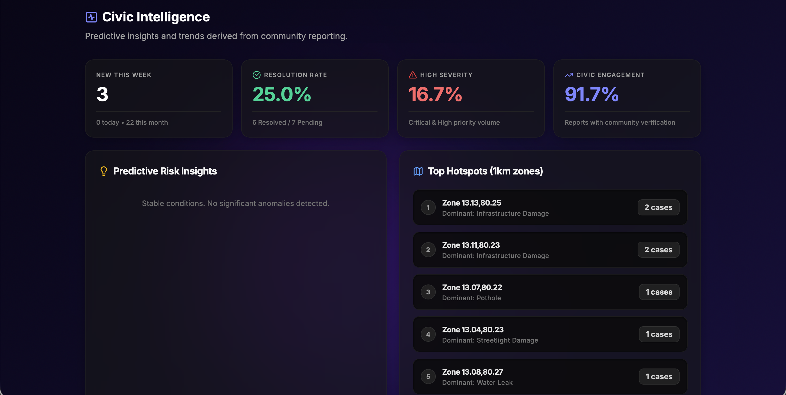
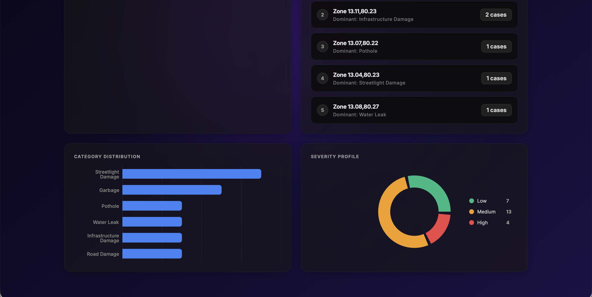
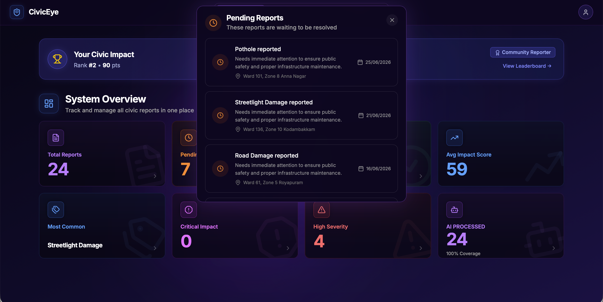

# 🚀 CivicEye

An AI-powered civic issue reporting platform that enables citizens to report public infrastructure problems, leverage Google Gemini AI for intelligent analysis, and help communities track and resolve issues efficiently.

---

## ✨ Features

- 🤖 AI-powered civic issue analysis using Google Gemini
- 📍 Report and track public infrastructure issues
- 📊 Interactive dashboard with real-time analytics
- 🏆 Community leaderboard and civic impact scoring
- 🔐 Secure user authentication with Firebase
- ☁️ Cloud Firestore database integration
- 📱 Fully responsive and modern user interface

---

## 🛠️ Tech Stack

### Frontend
- React
- Vite
- Tailwind CSS
- JavaScript (JSX)

### Development Platform
- Google AI Studio

### Backend & Database
- Firebase Authentication
- Cloud Firestore
- Firebase Security Rules

### Artificial Intelligence
- Google Gemini API

### Deployment
- Google AI Studio (Google Cloud Run)

### Version Control
- Git
- GitHub

---
## 📸 Screenshots

### Home Page


### User Dashboard


### Report Issue


### Issue Details


### Civic Board


### Analytics


### Brief View


---

---

## 🚀 Run Locally

### Prerequisites

- Node.js (v18 or later)
- npm

### Installation

1. Clone the repository

```bash
git clone https://github.com/barsha-fullstackFanatic/civiceye.git
cd civiceye
```

2. Install dependencies

```bash
npm install
```

3. Configure your environment

Create a `.env.local` file with your own Firebase configuration and Gemini API key.

> **Note:** API keys and Firebase credentials are **not included** in this repository. You'll need your own Firebase project and Gemini API key to run the application locally.

4. Start the development server

```bash
npm run dev
```

---

## 🌐 Deployment

This project was developed using **Google AI Studio** and deployed through **Google AI Studio**, which uses **Google Cloud Run** as the hosting platform.

---

## 👨‍💻 Author

**Barsha Kumari**

GitHub: https://github.com/barsha-fullstackFanatic
